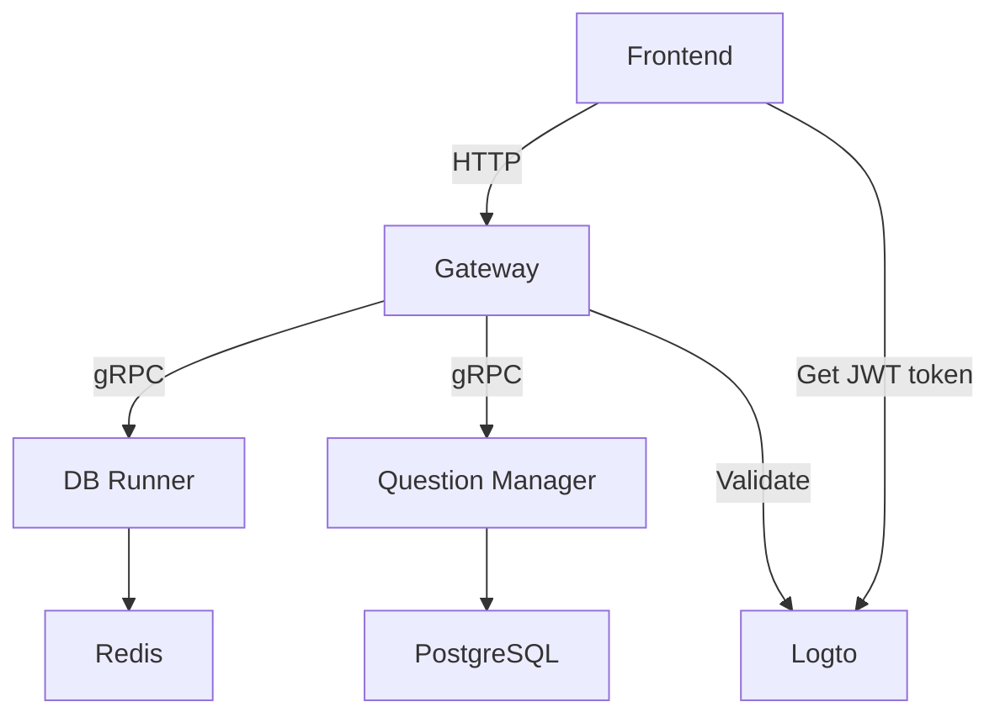

# @database-playground/backend

This is the backend for the Database Playground application.

## Structure

The backend consists of 3 microservices:

- `dbrunner-service`: Executes arbitrary SQL statements provided by users. Environments are isolated to ensure consistent results for each schema and query pair. Requires Redis to cache the execution results.
- `question-manager-service`: Retrieves questions and schemas, and provides mutation methods. Requires a PostgreSQL database with the questions and schemas.
- `gateway-service`: A RESTful API that provides access to the services mentioned above. [An OpenAPI schema is provided](internal/services/gateway/openapi/openapi.yaml). Authentication requires a token from a Logto instance.

The services other than `gateway` are protected with mTLS, meaning clients accessing these services must provide a client TLS certificate (zero trust). Usually, the gateway is the only client to these microservices.



To access the gateway, your front-end should provide a token with the required scopes (see Scopes below). The front-end instructs users to log in on Logto, which then returns the token to the front-end, and the front-end puts this token in subsequent API requests.

## Build and Run

Using Devenv is recommended for development, as it reproduces the development environment to ensure consistency.

You should set up a Logto instance to enable proper authentication for this backend. Refer to the [Logto documentation](https://logto.dev/docs) for more information.

After setting up your Devenv environment, copy `.env.example` to `.env`, and run the following commands to create TLS certificates:

```bash
task ca client-cert server-cert PROPERTY=dev

task protobuf go-generate
```

Then, run `devenv up` to start the PostgreSQL, Redis, microservices, and the gateway. Access the gateway from `localhost:3100`.

To get a glimpse of the backend, you can import the seed data by running the following command:

```bash
for seed in internal/database/seeds/*.sql; do
    psql -h localhost -U username -d pan93412 < $seed
done
```

If you want to build the service as a standalone executable file, run `task build`. To build Docker images, run `task build-docker`.

To run the tests, run `task test`.

## Scopes

You can create the following scopes in Logto:

| Permission       | Description                                    |
| ---------------- | ---------------------------------------------- |
| `write:resource` | Allow writing to public and private resources. |
| `challenge`      | Allow making SQL challenges.                   |
| `read:schema`    | Allow reading schema.                          |
| `read:question`  | Allow reading question.                        |
| `read:solution`  | Allow reading the solution of a question.      |

To find the required scopes for each API, please refer to the [OpenAPI schema](internal/services/gateway/openapi/openapi.yaml).

## Docs

The RESTful API documentation is available at the path `openapi/docs` on the gateway service. In the development environment, this corresponds to `http://localhost:3100/openapi/docs`. The documentation is powered by [Scalar](https://github.com/scalar/scalar).

## License

This project is licensed under the [AGPL-3.0-or-later](./LICENSE) license. We encourage you to open source your work if you made modifications to this project!
